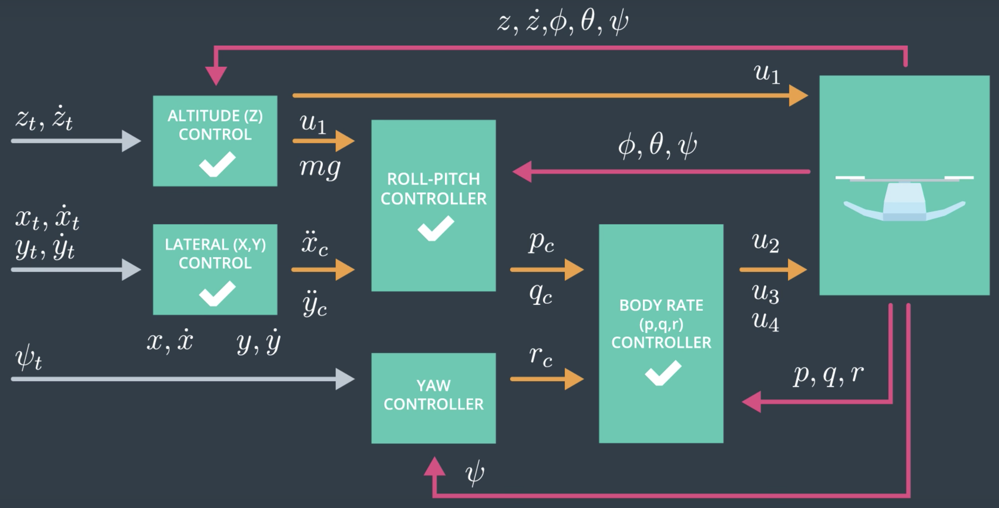
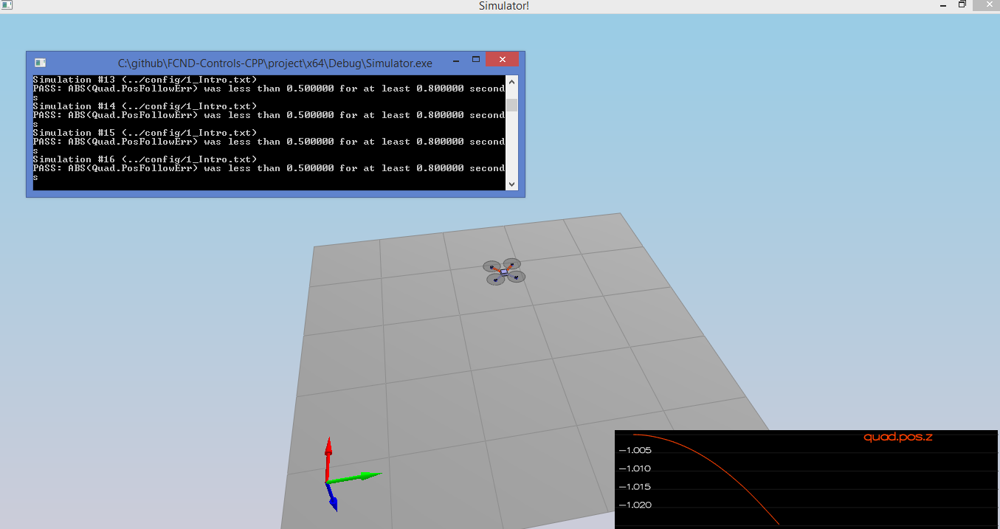
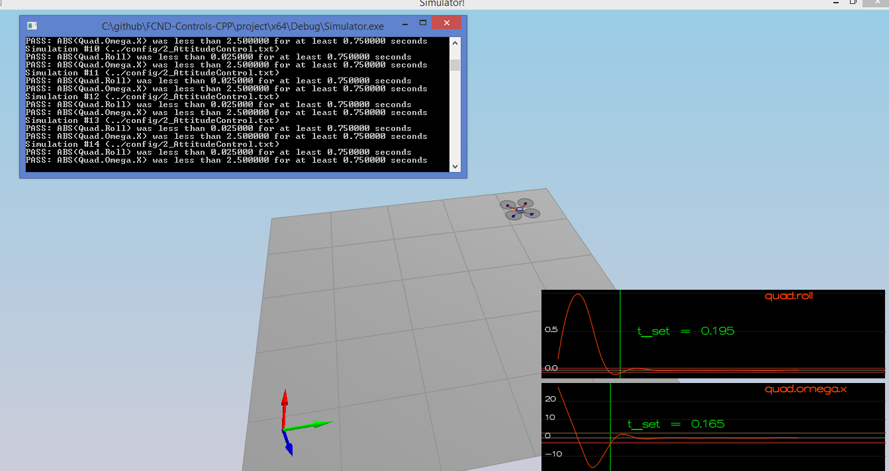
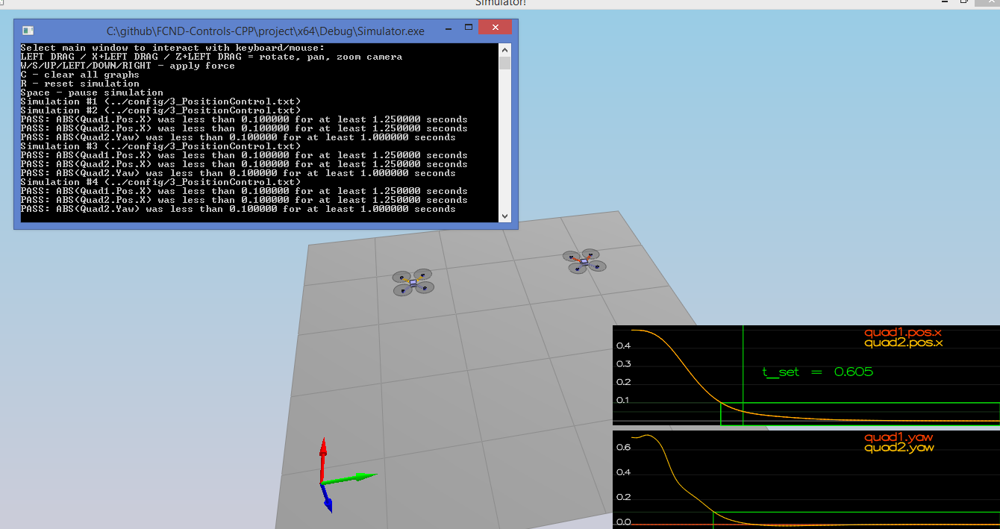
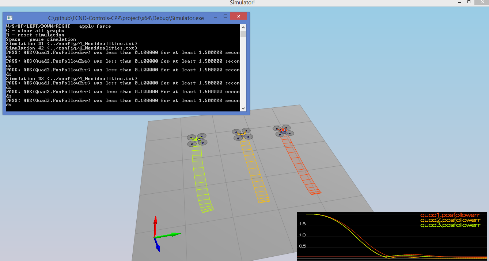
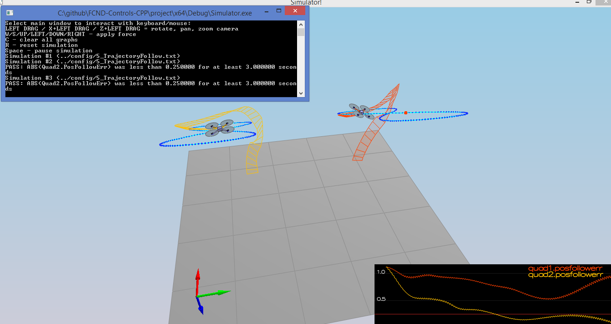
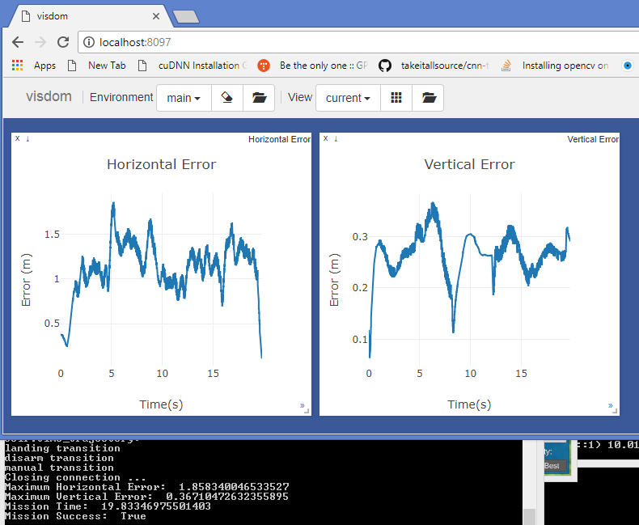

# Control of a 3D Quadrotor #

## The Goal of this Project ##

In the real world the flight controller is usually implemented in C or C++. So in this project we will implement your controller in C++. The code you write here can eventually be transferred to a real drone!

<p align="center">

</p>

You may find it helpful to consult the [Python controller code](https://github.com/udacity/FCND-Controls/blob/solution/controller.py) as a reference when you build out this controller in C++.

## Writeup ##
- [README](./README.md) 

## Implemented Controller ##
- [QuadControlParams.txt](config/QuadControlParams.txt): This file contains the configuration for the controller. While the simulator is running, you can modify this file, and the simulator will "refresh" those parameters on the next loop execution.
- [QuadControl.cpp](src/QuadControl.cpp): This is where all the fun is, but I should not say this because this file contains the implementation of the controller only. Most of the time needed to pass the scenarios is spend on the parameter tuning.

### Implemented body rate control in C++. ###
#### The controller should be a proportional controller on body rates to commanded moments. The controller should take into account the moments of inertia of the drone when calculating the commanded moments. ####

- changes are reflected in [BodyRateControl](src/QuadControl.cpp#L113)
```
- Body rate controller collects the commanded roll, pitch and yaw.
- These are translated into desired rotational acceleration along the axis in the body frame(momentCmd).
- Calculation:  momentCmd = I * kpPQR * (pqrCmd - pqr);
- V3F structure is used to store moments of inertia in every asis (I)
- kpPQR is a V3F used to store proportional gains on angular velocity on all axes
- Simple proportional controller with error (pqrCmd - pqr) 
- error indicates desired body rates [rad/s](pqrCmd) – current or estimated body rates [rad/s](pqr)
```    

### Implement roll pitch control in C++. ###
#### The controller should use the acceleration and thrust commands, in addition to the vehicle attitude to output a body rate command. The controller should account for the non-linear transformation from local accelerations to body rates. Note that the drone's mass should be accounted for when calculating the target angles. ####

- changes are reflected in [RollPitchControl](src/QuadControl.cpp#L141-L161)
```
- Purpose is to calculate a desired pitch and roll rates 
- Based on a desired global lateral acceleration, the current attitude, and desired collective thrust
- First we obtain current tilt from the rotation matrix R.
- Then we compute the desired tilt by normalizing the desired acceleration by the thrust. 
- Prevent drone flipping using max-min constrain
- Determines the desired roll and pitch rate in the world frame
- Finally, in order to output the desired roll and pitch rate in the body frame
- Tuning kpBank and kpPQR(again until the drone flies more or less stable upward)
```

### Implement altitude controller in C++. ###
#### The controller should use both the down position and the down velocity to command thrust. Ensure that the output value is indeed thrust (the drone's mass needs to be accounted for) and that the thrust includes the non-linear effects from non-zero roll/pitch angles.Additionally, the C++ altitude controller should contain an integrator to handle the weight non-idealities presented in scenario 4. ####

- changes are reflected in [AltitudeControl](src/QuadControl.cpp#L189-L200)
```
- Purpose is to calculate desired quad thrust baed on comments listed in the code.
- Based on altitude and vertical velocity (actual, setpoint) and vertical acceleration feed-forward
- Ensure z velocity command is within limits
- Then we compute Error integration part of the PID
- Determine desired acceleration, vertical acceleration in body frame and
- Finally compute trust
```

### Implement lateral position control in C++. ###
#### The controller should use the local NE position and velocity to generate a commanded local acceleration. ####

- changes are reflected in [LateralPositionControl](src/QuadControl.cpp#L234-L247)
```
- Purpose is to calculate the desired acceleration in the global frame 
- Based on desired lateral position/velocity/acceleration and current pose parameters
- Ensure Contrain desired velocity
- Determine PD controller + feedforward and
- Finally constrain desired acceleration
```

### Implement yaw control in C++. ###
#### The controller can be a linear/proportional heading controller to yaw rate commands (non-linear transformation not required). ####

- changes are reflected in [YawControl](src/QuadControl.cpp#L266-L270)
```
- Purpose is to calculate the desired yaw rate from the commanded yaw and the yaw parameters
- Compute yaw delta between commanded and observed yaw values
- Ensure you always travel the smallest angle from observed yaw to commanded yaw
- We need to normalize the error using fmodf to account for angle wrap
- Finally compute yaw rate with the proportional yaw constant
```

### Implement calculating the motor commands given commanded thrust and moments in C++. ###
#### The thrust and moments should be converted to the appropriate 4 different desired thrust forces for the moments. Ensure that the dimensions of the drone are properly accounted for when calculating thrust from moments. ####

- changes are reflected in [GenerateMotorCommands](src/QuadControl.cpp#L71-L90)
```
- Purpose is to calculate each motor command thrust from commanded collective thrust and commanded moment
- The constants k_m and k_f are not given. Instead, the ration between them, kappa, is given.
- The distance L is the distance from the center of the quad to one of the rotors.
- Based on the input from the controller we can set the individual motor thrust commands.
- F1, F2, F3, F4 for individual thurst command for the front (left,right) and rear (left,right) motors.
- The l is a distance between x-axis and propeller location
- l is equal to half of the distance between neighboring propellers at 45° relative to each axis:
- Formulate the following 
  Ft = collThrustCmd;         // F1+F2+F3+F4
  Fp = momentCmd.x / l;       // F1-F2+F3-F4
  Fq = momentCmd.y / l;       // F1+F2-F3-F4
  Fr = momentCmd.z / kappa;   // F1-F2-F3+F4
- Using above equations, we find individual values of F1, F2, F3, and F4.
- Finally we clip them to min and max values and then pass these clipped values to the motors.
```

## Flight Evaluation ##
#### Your C++ controller is successfully able to fly the provided test trajectory and visually passes inspection of the scenarios leading up to the test trajectory. #####
Ensure that in each scenario the drone looks stable and performs the required task. Specifically check that the student's controller is able to handle the non-linearities of scenario 4 (all three drones in the scenario should be able to perform the required task with the same control gains used). 

#### Scenario 1 – Intro ####
<p align="center">

</p>

#### Scenario 2 – Attitude Control ####
<p align="center">

</p>

#### Scenario 3 – Position Control ####
<p align="center">

</p>

#### Scenario 4 – Nonidealities ####
<p align="center">

</p>

#### Scenario 5 – Trajectory Follow ####
<p align="center">

</p>

#### Python result for reference ####
<p align="center">

</p>
- python repo https://github.com/vinayakkankanwadi/FCND-Controls
